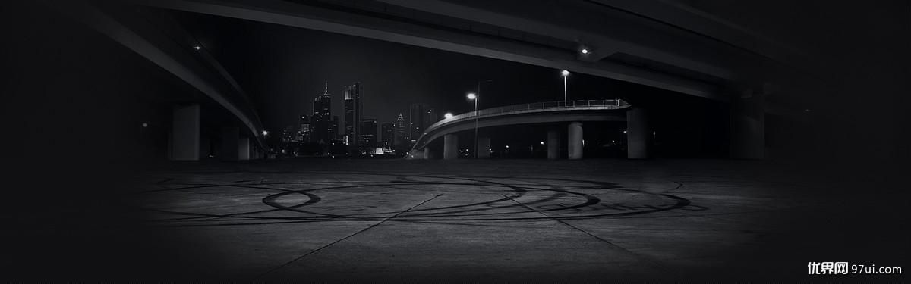

### css3实现轮播图

效果如下所示:

布局代码:

    

      <ul class="img">
            <li></li>
            <li></li>
            <li></li>
            <li></li>
            <li></li>
        </ul>
        <ul class="nav">
            <li>1</li>
            <li>2</li>
            <li>3</li>
            <li>4</li>
            <li>5</li>
            <li class="bg"></li>
        </ul>
    

css代码

    *
    {
    margin: 0;;
    padding: 0;
    }.container
    {
    position: relative;;

    overflow: hidden;

    width: 700px;
    height: 400px;
    margin: 100px auto;
    
    border-radius: 20px;
    box-shadow: 2px 4px 9px #000;
    }.container ul.img
    {
    position: absolute;
    top: 0;
    left: 0;
    
    width: 3500px;
    
    animation: imgs 10s infinite;
    }.container ul.img li
    {
    float: left;;

    list-style: none;
    }.container ul.nav
    {
    position: absolute;
    bottom: 15px;;
    left: 15px;
    }.container ul.nav li
    {
    line-height: 21px;

    float: left;

    width: 24px;
    height: 21px;
    margin-right: 10px;
    
    list-style: none;
    
    text-align: center;
    
    color: #fff;;
    background: url('../images/a.png')
    }.container ul.nav > li.bg
    {
    position: absolute;
    top: 0;
    left: 0;
    
    animation: bg 10s infinite;;
    
    opacity: .5;
    background: url('../images/b.png');
    }@keyframes imgs
    
    {
    
    0%
    {
        left: 0;
    }15%
    {
        left: 0;
    }20%
    {
        left: -700px;
    }35%
    {
        left: -700px;
    }40%
    {
        left: -1400px;
    }55%
    {
        left: -1400px;
    }60%
    {
        left: -2100px;
    }75%
    {
        left: -2100px;
    }80%
    {
        left: -2800px;
    }95%
    {
        left: -2800px;
    }100%
    {
        left: 0;
    }
    }@keyframes bg
    
    {
    
    0%
    {
        left: 0;
    }15%
    {
        left: 0;
    }20%
    {
        left: 34px;
    }35%
    {
        left: 34px;
    }40%
    {
        left: 68px;
    }55%
    {
        left: 68px;
    }60%
    {
        left: 102px;
    }75%
    {
        left: 102px;
    }80%
    {
        left: 136px;
    }95%
    {
        left: 136px;
    }100%
    {
        left: 0;
    }
    }

