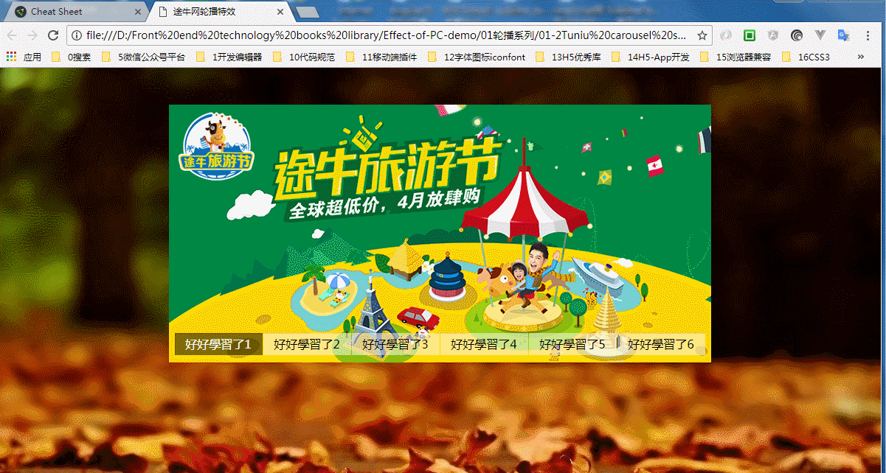

### 途牛网轮播特效

需求:

* 鼠标移入下方按钮,实现按钮状态切换
* 鼠标移入下方按钮,对应的背景图需要不同的切换
* 鼠标移入到轮播图区域时,左右切换按钮需要显示,移出隐藏
* 点击左右按钮,能实现图片的切换,底下对应的按钮状态也会跟着切换

最终实现效果图如下所示:

布局思路:

* 最外层设置背景图显示
* 中间盒子wrap水平居中显示
* wrap设置相对定位,若干张图片同级排布,全设置为隐藏,默认第一张显示
* 底下按钮ul,li布局,ul绝对定位至底部与img同级,左右切换按钮同样绝对定位,同样与Ul同级,改变left,top,right值,需要注意的是背景定位css雪碧图的应用

js代码

* 注意一个技巧,定义一个全局变量的索引index
* 底部按钮状态的切换,用hover即可解决,动态的添加一个class实现状态切换,找到对象集合元素,给当前元素添加addClass(),然后同级元素,也就是兄弟级元元素去掉之前活跃状态的class，siblings()兄弟级元素,removeClass(),移除class,注意兄弟元素
* 鼠标移入到wrap,区域,左右按钮显示,移出隐藏,同上,一个hover可以解决
* 左右按钮的切换,点击事件click,注意存储列表元素的长度,此时根据全部定义变量的索引,点击左按钮--操作,只是要注意限制它的一个范围,当index减少小于0时,应当让他循环到最后一张,当点击右按钮,点到最后一张,让它回到第一张，对Index进行条件的限制判断
* 点击左右按钮,背景图片切换与底下按钮同步走策略,同样是根据那个索引值进行匹配,达到背景图片与按钮同步的效果(eq())的巧妙使用

具体实现代码如下所示:

    $(function(){
        var index = 0;
        var imgLen = $("#wrap img");  // 获取图片
    // 鼠标移入到下面的li时状态
      $("#wrap ul li").hover(function(){
       	    index = $(this).index();   // 添加索引
       	    console.log(index);
       	    $(this).addClass("first").siblings().removeClass("first");
       	    $("#wrap img").eq(index).show().siblings("img").hide(); 
       })
       // 单击盒子左右按钮显示和隐藏
       $("#wrap").hover(function(){   // 第一个回调函数为鼠标移入
       	    $("#wrap div.left").fadeIn();
       	    $("#wrap div.right").fadeIn();
       },function(){  // 鼠标移出
       	    $("#wrap div.left").fadeOut();
       	    $("#wrap div.right").fadeOut();
        });
       	// 点击左右按钮切换
       	$("#wrap div.left").click(function(){
       	     index--;
       	     document.title = index;
       	     if(index<0){
       	         index = imgLen.length-1;
       	     }
       	       $("#wrap img").eq(index).show().siblings("img").hide();
       	       $("#wrap ul li").eq(index).addClass("first").siblings().removeClass("first"); // 这里匹配一个eq()进行匹配     
       	 })
       	 // 点击右按钮
       $("#wrap div.right").click(function(){
       	      index++;
       	      document.title = index;
       	      if(index>imgLen.length-1){
       	          index = 0;
       	      }
       	      $("#wrap img").eq(index).show().siblings("img").hide();
       	      $("#wrap ul li").eq(index).addClass("first").siblings().removeClass("first");
       	})
    })
### 额外拓展

加上一定时器,就可以自动进行轮播了的setInterval(),但是要注意的是清除定时器与开启定时器,当鼠标移到盒子wrap时,就应当清除定时器,禁止循环播放,移开时,又开启定时器

