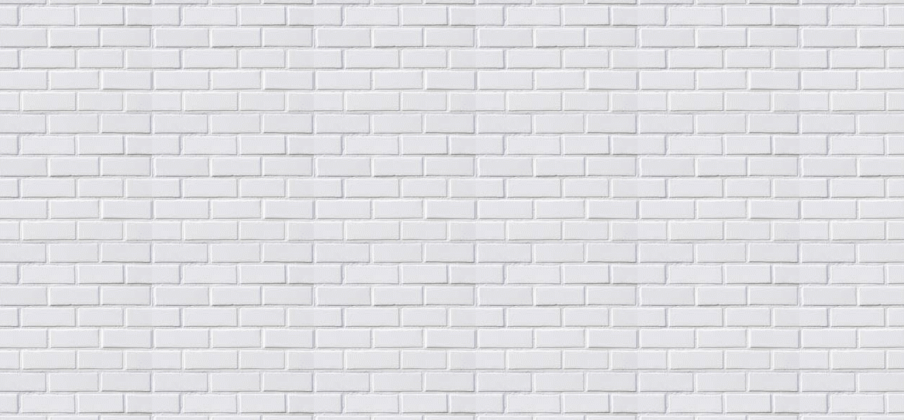

### 桌面级拖拽应用

效果实例如下所示



布局:

背景图片,动态的创建dom元元素进行添加

css代码

```
*{
	padding: 0;
	margin: 0;
}
body{
	background:url(../img/bg.jpg);
}
```

js代码

```
// 鼠标按下
    document.onmousedown = function(e) {
        var e = e || event;
        var x = e.clientX; // 鼠标x轴的坐标
        var y = e.clientY; // 鼠标y轴的坐标
        var box = document.createElement('div'); // 创建box元素
        box.style.cssText = 'position:absolute;left:' + x + 'px;top:' + y + 'px;border:1px dotted black'; // 点状线边框
        // 鼠标移动
        document.onmousemove = function(e) { // 鼠标按下时
            var e = e || event;
            var x1 = e.clientX; // 鼠标x轴的距离
            var y1 = e.clientY; // 鼠标y轴的距离

            var w = x < x1 ? x1 - x : x - x1; // 向右拖还是向左拖动,图片的宽度
            var h = y < y1 ? y1 - y : y - y1; // 图片的高度

            var l = x1 > x ? x : x - w; // 图片的left的值
            var t = y1 > y ? y : y - h; // 图片top的值

            box.style.cssText = 'position:absolute;width:' + w + 'px;height:' + h + 'px;left:' + l + 'px;top:' + t + 'px;border:1px dotted black';
            document.body.appendChild(box); // 将box添加到bod里面去
        }
        // 鼠标抬起
        document.onmouseup = function() { // 鼠标抬起
            document.onmousemove = document.onmouseup = null;
            var random = Math.floor(Math.random() * 20); // 随机数，20张图片
            box.style.border = 0; // 去掉边框
            box.style.background = 'url(img/' + random + '.jpg) no-repeat center center/100% 100%';

        };
        return false;
    }
```

效果分析:

注意鼠标,兼容性的处理,能实现拖动一个元素,分为三步,鼠标按下,鼠标移动,鼠抬起

1. 怎么获取鼠标的位置,x轴的距离,y轴的距离
2. 创建一个元素,赋值,元素的位置等于鼠标的位置
3. 鼠标移动,又有一个新的x值和y值
4. 获取图片的宽度,高度,如何确定是往左拖还是往右拖
5. 图片的left值和top值
6. 鼠标抬起,注意要去掉鼠标移动和鼠标抬起的事件
7. 鼠标抬起时,添加背景图片,而且是随机的，去除默认事件return false;